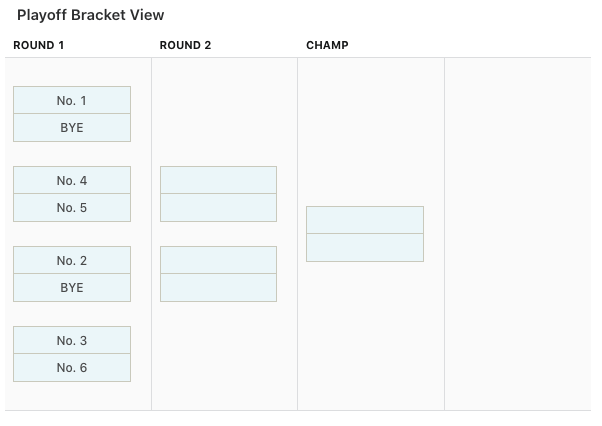

Season Schedule
===============
The fantasy football season schedule has two phases: the :ref:`regular-season` and the
:ref:`playoffs`. Regular season and playoff schedules are both influenced by
:ref:`divisions`.

.. _regular-season:

Regular Season
--------------
Our league plays a 14-week regular season, beginning with the first NFL regular season
game.

The ESPN app provides an automatic scheduler which has historically produced uneven
team schedules. We override the automatic schedule so that every team plays each divisional
opponent at least twice.

.. _playoffs:

Playoffs
--------
.. admonition:: New in the 2022 season

   The below playoff structure was revised from a 6-6 to an 8-8 structure beginning with the
   2022-23 season. The playoff order system has been revised slightly to accommodate divisional
   finals in week 16.

This league uses a 3-week single-elimination championship format. Following the regular
season, The top four teams in each division will participate in the playoffs. Among these
teams, the seed in the playoffs is determined by overall win-loss record, with ties broken
by overall points for. This is what the structure looks like:

The overall winner receives the League Trophy (the "Golden Football").

This structure is mirrored for the bottom-ranking teams, with teams advancing with each loss.
The team that loses all of their games in this bracket will receive the last-place trophy
(the "Golden Toilet Seat").

Trophy recipients are expected to keep their trophies on public display at their
workstation until the conclusion of the following season.