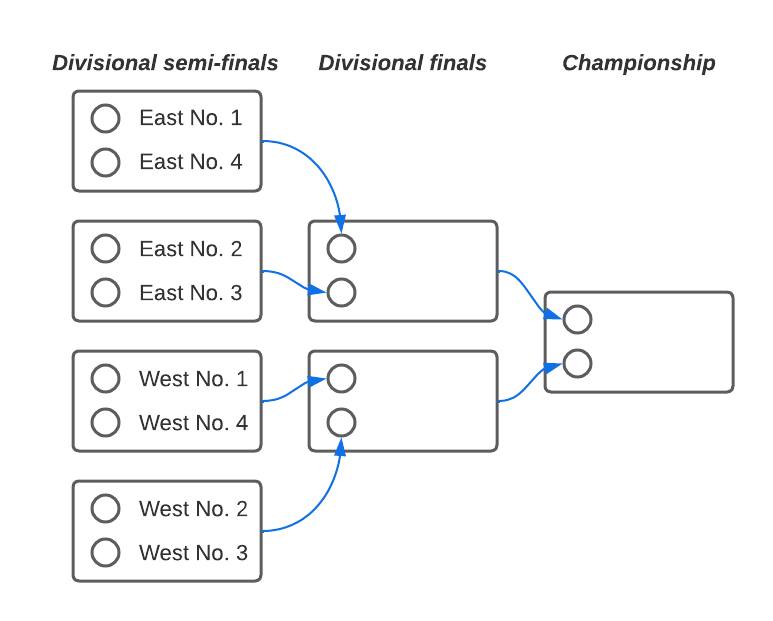

Season Schedule
===============
The fantasy football season schedule has two phases: the :ref:`regular-season` and the
:ref:`playoffs`. Regular season and playoff schedules are both influenced by
:ref:`divisions`.

.. _regular-season:

Regular Season
--------------
Our league plays a 14-week regular season, beginning with the first NFL regular season
game.

The ESPN app provides an automatic scheduler which has historically produced uneven
team schedules. We override the automatic schedule so that every team plays each divisional
opponent twice, and evenly distributes other teams for the remainder of the season.

.. _playoffs:

Playoffs
--------
.. note::
   The below playoff structure was introduced in the 2021 season due to a change in the NFL
   regular season schedule from 17 to 18 weeks.

This league uses a 3-week single-elimination championship format. Following the regular
season, The top two teams in each division will participate in the playoffs, in addition
to two wildcard teams. Among these teams, the seed in the playoffs is determined by overall
win-loss record, with ties broken by overall points for. The top two seeds get a bye in the
first week of the playoffs. This is what the structure looks like:

The overall winner receives the League Trophy (the "Golden Football").

This structure is mirrored for the bottom-ranking teams, with the two worst-performing teams
receiving a bye week in the first round of the playoffs and teams advancing with each loss.
The team that loses all of their games in this bracket will receive the last-place trophy
(the "Golden Toilet Seat").

Trophy recipients are expected to keep their trophies on public display at their
workstation until the conclusion of the following season.