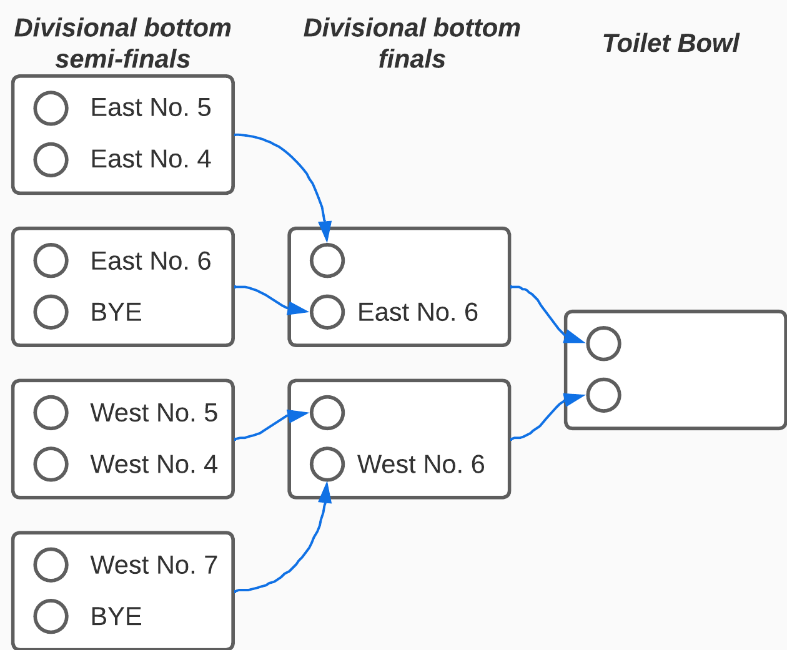

Season Schedule
===============
The fantasy football season schedule has two phases: the :ref:`regular-season` and the
:ref:`playoffs`. Regular season and playoff schedules are both influenced by
:ref:`divisions`.

.. _regular-season:

Regular Season
--------------
Our league plays a 14-week regular season, beginning with the first NFL regular season
game.

.. _playoffs:

Playoffs
--------

This league uses a 3-week single-elimination championship format. Following the regular
season, The top three (12-team league) or four (14-team league) teams in each division will
participate in the playoffs. Among these teams, the seed in the playoffs is determined by
overall win-loss record, with ties broken by overall points for. This is what the structure
looks like for the 2023 season:

.. image:: _assets/playoff_bracket.png

The overall winner receives the League Trophy (the "Golden Football").

This structure is mirrored for the bottom-ranking teams, with teams advancing with each loss.
Since there are six teams in each division, the bottom three teams participate with a
first-round "BYE" (automatic advancement) for the lowest-ranked team in each division.
This is what the structure looks like:

The team that loses all of their games in this bracket will receive the last-place trophy
(the "Golden Toilet Seat").

Trophy recipients are expected to keep their trophies on public display at their
workstation until the conclusion of the following season.